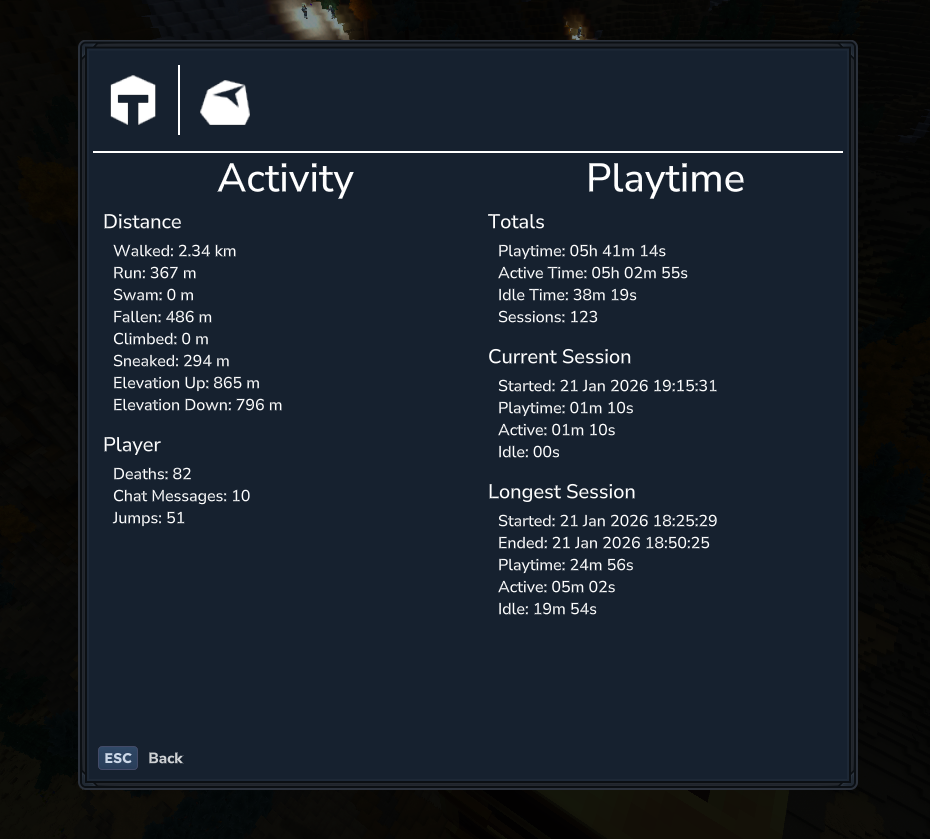
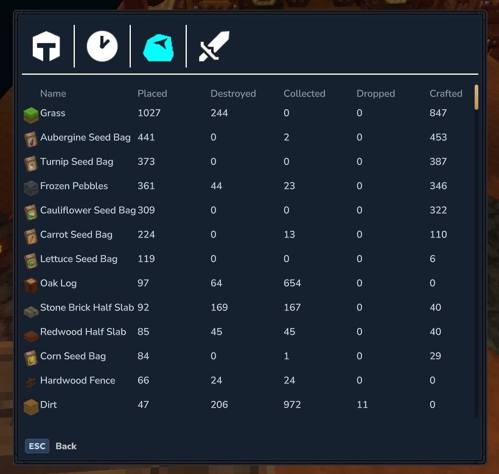

### Introduction
LovelyStats is a server side plugin to track your in-game infos
I tried to make it as efficient as possible so there is no perfomance impact.
### Screenshots
| | |
|---|---|
|  |  |

### Stats tracked
- Playtime is tracked as sessions with active and idle time
- Blocks placed
- Blocks broken
- Items collected
- Items dropped
- Items crafted
- Tools broken (not implemented yet)

### Displaying stats
Use the /stats command to open the ui and see your stats. 

### Implementation
I tried to use events as much as possible. But some things are not possible with it.   
Items collected. There is an event *InteractivelyPickupItemEvent* but this is only for interactables.  
Items crafting. There is an event *CraftRecipeEvent* but this is only for the players crafting.  

To fix this I use the PacketAdapters. I dont like this solution because i dont know how consistent it is. Especially the one for the crafting.
So if someone knows a better solution to that I would gladly take some help.
